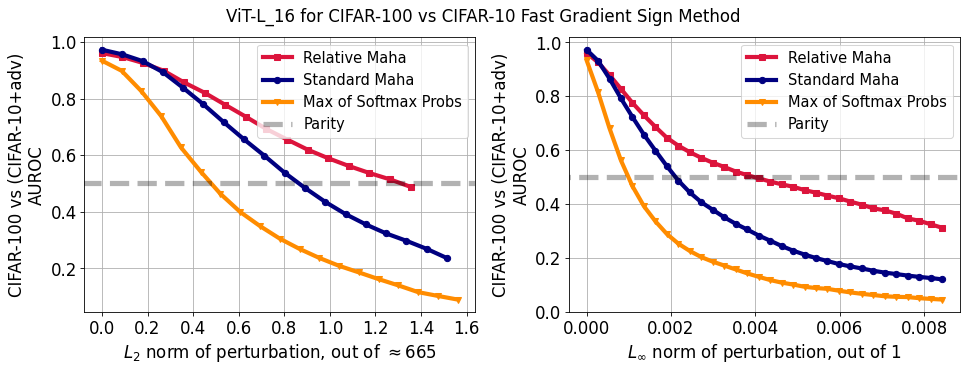
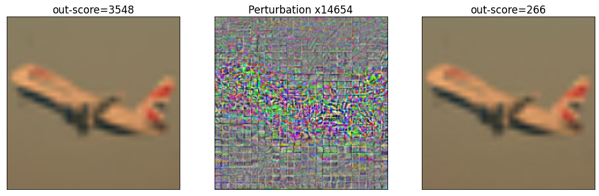
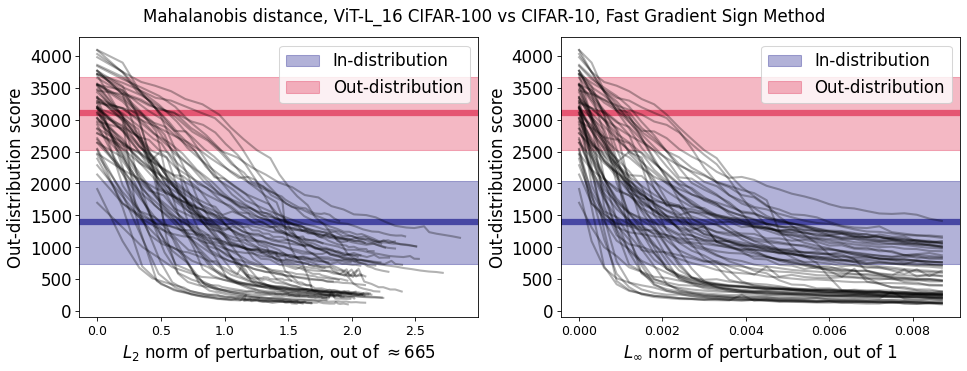

# Adversarial vulnerability of powerful near out-of-distribution detection
by Stanislav Fort

In this repository we're collecting replications for the key experiments in the [*Adversarial vulnerability of powerful near out-of-distribution detection*](https://arxiv.org/abs/2201.07012) paper by [Stanislav Fort](https://scholar.google.com/citations?user=eu2Kzn0AAAAJ&hl=en).

The use of a large, pretrained and finetuned Vision Transformer for near-OOD detection on the CIFAR-100 vs CIFAR-10 task is demonstrated in [this Colab](https://github.com/stanislavfort/adversaries_to_OOD_detection/blob/main/adversaries_to_strong_OOD_detectors.ipynb). We showcase the use of the Standard Mahalanobis distance, the Relative Mahalanobis distance (presented in [this paper](https://arxiv.org/abs/2106.09022)), and the baseline Maximum of Softmax Probabilities. We show how to compute adversarial attacks on the 3 OOD metrics, and how the AUROC on the OOD task drops with the attack strength. The key result you will be able to replicate at the end of the Colab is the observation that *Relative* Mahalanobis distance is the most robust method out of the 3, followed by the standard Mahalanobis distance. The Max of Softmax Probabilities is the least robust to adversarial attacks.

The results you should expect from running the Colab in full (in around 45 minutes on a free GPU instance) are shown in bellow.

Colab:
https://github.com/stanislavfort/adversaries_to_OOD_detection/blob/main/adversaries_to_strong_OOD_detectors.ipynb

Loss of AUROC on CIFAR-100 vs CIFAR-10 with adversarial perturbation strength:

An example of a source image, its magnified perturbation, and the resulting perturbed image:

The change of the Mahalanobis distance OOD score for 64 test images vs their perturbation strength:

